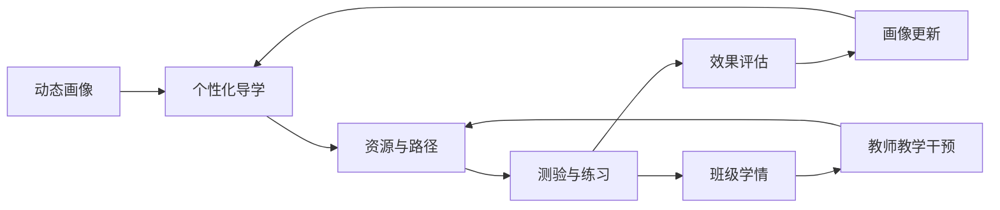
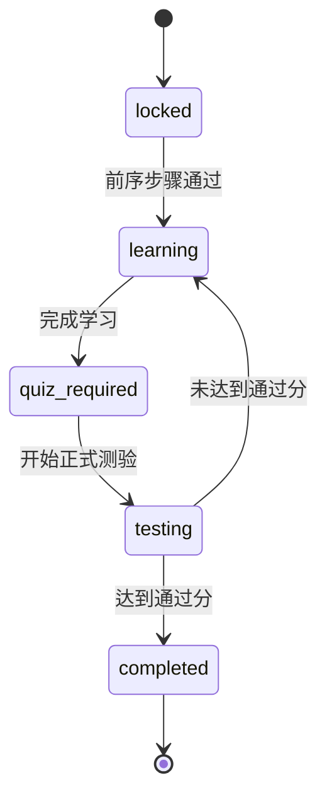
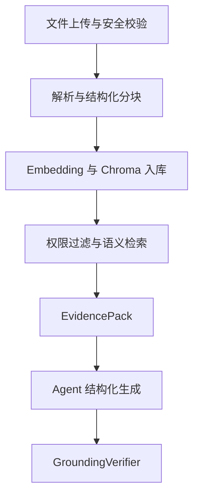
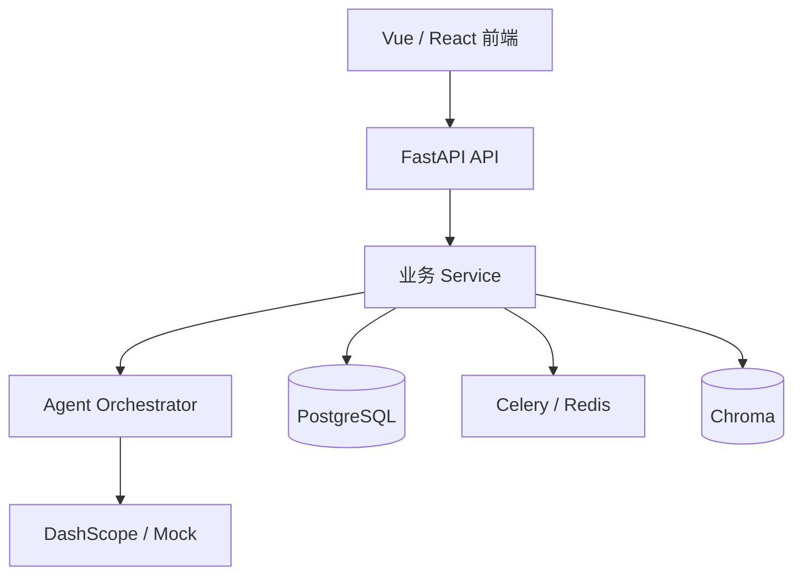

[README_PrismMind.md](https://github.com/user-attachments/files/30888375/README_PrismMind.md)
# 棱镜智教 · PrismMind

> 面向学生持续成长的“导—学—测—练—评”多智能体教学辅助系统

PrismMind 以动态学生画像为个性化基础，以个人与课程知识库为事实依据，通过多智能体协作连接资源生成、学习路径、测验练习、效果评估、智能辅导与教师教学支持，形成可运行、可验证、可持续调整的师生双循环。

系统不试图替代教师，也不只是一个套用教育界面的通用聊天机器人。大模型负责理解、归纳、生成与解释；规则、权限、状态机和数据库负责评分、路径推进、答案隐藏、访问控制与过程审计；教师始终保留正式教学内容和教学决策的最终复核权。

## 项目信息

| 项目 | 内容 |
| --- | --- |
| 项目名称 | 棱镜智教 · PrismMind |
| 项目定位 | 面向高校学生成长与教师教学改进的多智能体教学辅助平台 |
| 参赛赛题 | A3：基于大模型的个性化资源生成与学习多智能体系统开发 |
| 团队名称 | 棱镜智教 · PrismMind |
| 核心成员 | 王天祺、安润宇、王浩然 |
| 指导教师 | 田英爱 |
| 学校 | 北京信息科技大学 |
| 文档版本日期 | 2026.07.18 |

## 项目背景

高校课程资源已经十分丰富，但“资源多”并不等于“学得更有效”。学生面对讲义、教材、论文、视频、代码仓库和题库时，往往仍然不知道：

- 应该从哪里开始；
- 哪些内容更符合自己的基础和目标；
- 当前是否真正掌握；
- 出错后应该复习什么；
- 下一阶段是否应该继续推进。

教师同样面临两类问题：一方面难以持续观察学生的细粒度学习状态，另一方面需要重复完成课程设计、资源整理、出题组卷和反馈总结。传统成绩表只能说明“得了多少分”，却很难直接回答“学生具体在哪里遇到困难”“哪些知识点需要重新讲解”“下一轮教学应该如何调整”。

PrismMind 因此将重点从“生成更多内容”转向“让学习过程形成证据闭环”：



## 核心理念

“棱镜”代表项目对学生差异的理解：系统不为学生凭空赋予颜色，也不使用一次性标签定义学生，而是通过持续对话、学习行为、测验结果和课程任务，让原本不易观察的差异被识别、解释并转化为更合适的资源形式、内容难度、学习顺序和训练方式。

学生端以“攀登山峰”为视觉隐喻：平台不规定统一终点，而是在关键节点帮助学生认识起点、选择方向和检验掌握。教师端以“树”为视觉隐喻：教师为学生提供方向和支持，人工智能帮助教师看见学情、整理证据并减少重复工作，但不会替代教师完成真正的育人判断。

## 核心能力

### 动态学生画像

- 通过自然语言对话采集专业、年级、课程、目标、基础、困难与学习偏好。
- 形成知识、实践、创新、考试、效率和质量六个维度。
- 保存画像摘要、当前课程、薄弱点、更新时间和历史对话。
- 使用测验、课程任务和学习行为形成后续更新证据。
- 每次变化记录来源、原因、更新前后值和幂等键。
- 使用有界更新避免一次异常成绩造成画像剧烈波动。

### 个人与课程知识库

- 学生可维护个人资料，教师可为课程建设共享知识库。
- 支持 PDF、Word、PowerPoint、Excel、CSV、TXT 和 Markdown。
- 文件经过格式、文件名、大小和 Magic Header 校验。
- 解析后保留页码、幻灯片、工作表、标题路径和字符范围等结构元数据。
- 完成分块、Embedding、Chroma 入库、权限过滤、语义检索和可选重排。
- 学生只能访问本人资料和已加入课程的授权资料，教师只能管理本人负责课程。

### 八类个性化学习资源

| 资源类型 | 主要结构 | 个性化依据 |
| --- | --- | --- |
| 课程文档 | 章节、概念、示例、误区、检查点 | 基础水平、目标、弱项、课程证据 |
| 思维导图 | 中心主题、层级、前置与关联 | 认知偏好、知识结构薄弱处 |
| 练习题 | 题型、难度、答案、解析、知识点 | 考试维度、历史错题、目标难度 |
| 拓展阅读 | 背景、延伸问题、阅读线索 | 兴趣方向、创新维度、课程进度 |
| 视频脚本 | 镜头、旁白、演示步骤、节奏 | 学习偏好、易错点、时长限制 |
| 代码案例 | 环境、代码、结果、调试点、练习 | 实践能力、语言与框架基础 |
| 小测验 | 题目、知识点、隐藏答案、评分规则 | 路径目标、当前阶段、通过门槛 |
| 实践项目 | 背景、任务拆分、里程碑、评价标准 | 职业/竞赛目标、实践维度 |

不同资源使用独立的结构化输出契约，避免所有生成结果退化为相同形式的 Markdown 长文。系统同时保存画像快照、知识来源快照、模型信息、质量分析和生成结果，便于后续复盘。

### 测验门控的学习路径

学习路径不是可以随意勾选完成的静态清单，而是由后端持久化的学习状态机：



每一步包含知识点、目标、预计时长、学习内容、完成标准、通过分、尝试次数和当前状态。只有阶段测验达到通过分，当前步骤才能完成并解锁下一步；未通过时，系统返回薄弱知识点和推荐资源。

当前版本已经实现“测验—路径门控”和“测验—画像更新”，测试后自动重排全部未完成步骤仍属于后续迭代能力。

### 测验、练习与确定性评分

- 支持单选、多选、判断和简答等题型。
- 提交前不向详情接口或开始接口返回标准答案。
- 提交后展示逐题得分、标准答案、解析和关联知识点。
- 单选、判断使用精确匹配，多选使用集合比较。
- 简答题按照关键词覆盖规则提供部分得分。
- 评分结果能够进入学习路径、画像更新和班级学情分析。

大模型负责生成题目、答案和解析，代码负责答案隐藏与确定性评分，避免相同答案因模型调用变化而得到不稳定结果。

### 智能辅导

- 支持解释概念、举例说明、易错点和复习步骤四种模式。
- 保存多轮会话上下文和用户评分。
- 支持流式输出、引用合并和失败重试。
- 提示模式优先给出思路，解释模式提供完整推导与示例。
- 会话、知识来源和权限在不同用户之间相互隔离。

严格证据模式下，如果知识库检索结果不足，系统不会让模型在空上下文中继续编造答案；允许使用通用知识补充时，也会明确说明内容并非完全来自所选课程资料。

### 学习效果评估

评估模块整合测验、资源、路径与行为数据，生成：

- 总体学习评价；
- 已掌握的优势知识点；
- 当前薄弱点与错误主题；
- 下一阶段学习建议；
- 学习反思与质量分析。

只有存在真实知识库证据时，系统才计算来源覆盖率、来源匹配度和诊断可信度。这些指标描述证据完整性与分析稳定性，并不等同于“答案正确概率”。不存在证据时，系统会明确显示不可计算原因。

## 学生端功能

| 模块 | 主要功能 |
| --- | --- |
| 学生首页 | 展示当前画像、开放路径、待完成任务、薄弱点和下一步行动 |
| 学习画像 | 对话构建六维画像、查看雷达图、摘要和变化证据 |
| 资源中心 | 上传知识资料并生成八类个性化学习资源 |
| 学习路径 | 创建阶段路径、完成学习、参加门控测验并解锁后续步骤 |
| 我的测验 | 管理独立测验、路径测验和综合测验，查看逐题结果 |
| 效果评估 | 查看优势、薄弱点、建议、证据状态与历史评估 |
| 智能辅导 | 基于个人或课程知识库进行多轮问答和流式解释 |
| 我的课程 | 使用课程码加入课程，访问资源、路径、作业和测验 |

## 教师端功能

教师端以课程为基本业务边界，围绕课程建设、课程知识库、班级学情、任务发布和内容生成展开。

### 课程与成员管理

- 创建课程并自动生成学生加入码。
- 查看课程状态、学生人数、任务数量和提交情况。
- 编辑课程简介、筛选课程并归档历史课程。
- 查看成员的六维画像、目标、薄弱点和最近更新时间。
- 课程任务完成后同步查看学生最新画像与作答情况。

### 课程知识库

- 上传课程讲义、教材、实验指导书和参考资料。
- 查看文件解析、知识入库、失败和完成状态。
- 复用同一课程资料生成课程设计、习题、试卷和实践项目。
- 通过检索测试验证知识库能否返回正确课程片段。

### 课程任务与班级学情

- 发布随堂测验、课程作业和阶段考试。
- 配置任务名称、类型、主题、题量、题型、难度、截止时间和知识范围。
- 查看学生作答状态、得分、提交时间和逐题反馈。
- 聚合班级高频错误知识点、平均达成率和任务完成情况。
- 使用班级画像与错误证据生成确定性教学建议或模型辅助总结。

### 教学内容生成

| 功能 | 生成内容 |
| --- | --- |
| 培养方案 | 核心能力、课程体系、实践体系、毕业要求和评价机制 |
| 课程设计 | 课程定位、教学模块、学时安排、教学方法和考核方案 |
| 教学设计 | 课堂目标、教学流程、活动安排与教学重点 |
| 习题生成 | 多题型习题、参考答案、解析和关联知识点 |
| 试卷生成 | 考试范围、题型分布、分值结构、答案和解析 |
| 实践项目 | 项目背景、任务拆分、里程碑、交付物和评价标准 |

教师可选择班级、课程资料和生成参数，将匿名班级画像、目标分布、薄弱点、任务达成率和错误主题纳入生成上下文。生成结果支持查看、复制、导出和历史管理，并保留知识来源、模型信息与质量分析；所有内容均定位为教师可编辑、可审核的教学草案。

## 多智能体系统

PrismMind 采用固定 Python 工作流协调多个职责明确的 Agent，而不是让模型自由决定调用任意工具。路径解锁、权限、答案隐藏、评分和题量契约由代码控制；模型只在被授权的语义任务中工作。

| Agent | 主要职责 | 关键校验 |
| --- | --- | --- |
| `ProfileAgent` | 画像对话、字段提取与摘要 | 对话轮次、字段完整性、分数范围 |
| `ResourceAgent` | 生成八类个性化学习资源 | 来源、章节结构、资源类型契约 |
| `PathPlanningAgent` | 生成学习路径、目标与完成标准 | 步骤顺序、知识点覆盖、通过分 |
| `TestAgent` | 生成测验、解析与教学重点总结 | 答案、题型、知识点和题量 |
| `TutorAgent` | 提示、解释和多轮辅导 | 证据充分性、引用、会话隔离 |
| `AssessmentAgent` | 学习评价解释与建议 | 不将证据质量包装为正确率 |
| `GroundingVerifier` | 对引用、结构、答案和证据进行二次核验 | `reject` 时阻断严格结果 |

`Orchestrator` 根据请求选择角色。复合任务会保存父级 `AgentRun`，再将画像分析、知识检索、内容生成和可信核验拆分为子运行。每次运行记录角色、模型、Provider、Token、证据数量、核验结论、时延、状态和错误，使多智能体协作能够被测试、审查和追踪。

## RAG 与可信生成

PrismMind 将知识库视为事实约束层，而不是简单的文件附件。完整链路如下：



`EvidencePack` 保存证据是否充分、引用 ID、来源、相似度、候选数量、模型和时延。严格 Agent 在证据不足时拒绝生成；上下文型 Agent 只有在显式告知用户后才能补充通用知识。

生成完成后，系统继续检查未知引用、未知文件名、答案完整性、章节来源和知识点覆盖。该机制可以降低无依据生成风险，但不能保证任何大模型输出绝对正确，正式教学内容仍需教师复核。

## 系统架构



系统采用前后端分离、业务服务分层、关系数据库与向量数据库协同、同步接口与异步任务并存的架构。

### 技术栈

| 层次 | 技术 | 用途 |
| --- | --- | --- |
| 主前端 | Vue 3、TypeScript、Vite | 应用页面、组件与构建 |
| UI 与状态 | Element Plus、Pinia、ECharts | 统一组件、状态管理与六维画像可视化 |
| 高视觉页面 | React 19、Three.js Island | 登录、学生山峰、教师树形等完整视觉场景 |
| 后端 API | FastAPI、Pydantic | REST API、OpenAPI 与请求响应契约 |
| 数据访问 | SQLAlchemy 2.0、Alembic | ORM、事务与数据库迁移 |
| 业务数据库 | PostgreSQL | 用户、课程、画像、路径、测验和审计数据 |
| 向量数据库 | Chroma | 知识分块向量与检索元数据 |
| 异步任务 | Celery、Redis | 任务队列、进度事件、缓存与降级 |
| 大语言模型 | DashScope / Mock Provider | 真实模型生成与离线工程验收 |
| 部署 | Docker Compose、Nginx | 开发环境与生产部署基础 |

## 后端目录结构

```text
Intelligent-Teaching/
├── frontend/                     # Vue / React 前端
├── backend/
│   ├── app/
│   │   ├── api/v1/               # REST API 路由与依赖注入
│   │   ├── schemas/              # Pydantic DTO 与 Agent 输出契约
│   │   ├── services/             # 业务服务、RAG、模型与质量分析
│   │   ├── repositories/         # 数据查询与事务封装
│   │   ├── models/               # SQLAlchemy 数据模型
│   │   └── tasks/                # Celery 任务与事件发布
│   └── alembic/                  # 数据库版本迁移
├── storage/                      # 上传文件持久化目录
└── docker-compose*.yml           # 开发与生产编排配置
```

> 目录名应以实际仓库为准；上述结构根据设计文档中的后端分层与部署方案整理。

## API 设计

后端接口统一使用 `/api/v1` 前缀。当前 OpenAPI 约包含 123 个 Path、140 个 Operation，并使用 JWT Bearer Token 保护需要认证的接口。

| 接口组 | 示例路径 | 主要能力 |
| --- | --- | --- |
| 认证 | `/api/v1/auth/login`、`/refresh`、`/me` | 登录、刷新令牌和当前用户 |
| 课程 | `/api/v1/courses/my`、`/join` | 课程、成员、加入码和课程任务 |
| 文件与知识 | `/api/v1/files/upload`、`/knowledge/retrieve` | 上传、入库、文档管理和检索 |
| 学生画像 | `/api/v1/student/profile/me`、`/chat` | 画像读取、对话构建和更新 |
| 学生资源 | `/api/v1/student/resources/generate-async` | 多类型资源与异步生成 |
| 学习路径 | `/api/v1/student/learning-paths` | 路径、步骤、测验门控和推荐 |
| 测验与练习 | `/api/v1/student/tests`、`/student/exercises` | 生成、开始、提交、评分和记录 |
| 辅导与评估 | `/api/v1/student/tutoring`、`/student/assessments` | 问答、解释、评价和建议 |
| 教师生成 | `/api/v1/teacher/*/generate` | 培养方案、课程、题卷和项目 |
| 异步任务 | `/api/v1/tasks/{task_id}/stream` | 任务状态、增量内容和 NDJSON 流 |

权限由 `require_student`、`require_teacher`、`require_admin` 以及资源所有权和课程成员关系共同控制。

## 核心数据实体

| 领域 | 主要实体 |
| --- | --- |
| 用户与课程 | `User`、`Course`、`CourseMember` |
| 文件与知识 | `FileAsset`、`KnowledgeDocument`、`KnowledgeChunk` |
| 学生画像 | `StudentProfile`、`ProfileConversation`、`ProfileMessage`、`ProfileEvidenceEvent` |
| 学习资源 | `LearningResource` |
| 学习路径 | `LearningPath`、`LearningPathStep` |
| 测验与练习 | `StudentTest`、`StudentExercise` |
| 教师任务 | `CourseAssignment`、`CourseSubmission` |
| 评估与生成 | `LearningAssessment`、`GeneratedArtifact` |
| 任务与审计 | `GenerationTask`、`AgentRun` |

PostgreSQL 保存业务事实、关系和可审计状态，Chroma 只保存知识分块向量及检索元数据。关系数据库和向量数据库使用一致的用户、课程和文档权限边界。

## 异步任务与流式输出

知识入库、长资源和教师文档生成可能持续较长时间。系统使用 `GenerationTask` 保存：

- `progress`
- `current_stage`
- `status_message`
- `partial_content`
- `result_payload`
- `error_message`

Celery Worker 执行任务，Redis 发布实时事件。前端 NDJSON 流先接收数据库 `snapshot`，随后接收 `delta`、`stage`、`done` 或 `error`。Redis 不可用时，后端可以降级为数据库轮询；页面刷新或网络断开后，也能够查询任务状态并从已保存的部分内容继续展示。

## 安全与隐私

- 使用 Access/Refresh JWT、bcrypt 和角色依赖完成认证授权。
- 同时校验资源所有权、课程 Owner 和有效课程成员关系。
- 关系数据库与 Chroma 使用相同权限过滤边界。
- 上传文件检查名称、扩展名、大小和 Magic Header。
- 使用 UUID 存储名、路径根目录校验和 SHA-256。
- 模型密钥仅通过环境变量配置，不写入日志或前端代码。
- 日志记录 Request ID、阶段、模型、时延、证据数量和错误类型，但不记录密码、API Key 或完整敏感学生数据。
- 演示环境使用虚构账号和自有课程资料。
- 教师查看班级上下文时使用匿名聚合信息。

当前安全能力适用于开发与演示环境。生产部署仍需补充 HTTPS、安全响应头、限流、WAF、提示注入检测、恶意文件扫描、密钥管理、备份、监控、灾备和隐私影响评估。

## 快速开始

### 1. 获取项目

```bash
git clone <项目仓库地址>
cd Intelligent-Teaching
```

请将占位地址替换为实际 Git 仓库地址。

### 2. 使用 Docker Compose 启动

```bash
docker compose -p intelligent-teaching up -d --build
docker compose -p intelligent-teaching ps
```

### 3. 检查服务

```bash
curl http://127.0.0.1:8000/api/v1/health
```

默认访问地址：

| 服务 | 地址 |
| --- | --- |
| 前端 | <http://127.0.0.1:5173> |
| Swagger API 文档 | <http://127.0.0.1:8000/docs> |
| 健康检查 | <http://127.0.0.1:8000/api/v1/health> |

### 4. 选择模型模式

默认使用 Mock Provider，适合无外部密钥的离线工程验收：

```env
LLM_PROVIDER=mock
```

需要演示真实模型时，在私有环境变量或密钥管理系统中配置：

```env
LLM_PROVIDER=dashscope
DASHSCOPE_API_KEY=<your-private-api-key>
```

不要将真实 API Key 写入源码、README、前端变量或提交到 Git。

Mock 模式用于验证接口、状态机、结构化契约和业务闭环，不代表真实大模型的内容质量；真实生成效果需要使用合法私有 Key 单独评测。

### 数据安全提醒

请勿在演示或验收环境执行：

```bash
docker compose down -v
```

该命令会删除 PostgreSQL、Redis、上传文件和 Chroma 使用的持久卷数据。

## 功能完成情况

| 能力 | 当前状态 | 准确说明 |
| --- | :---: | --- |
| 动态学生画像 | ✅ | 对话构建以及测验/任务证据的有界更新已形成主要闭环 |
| 个人与课程知识库 | ✅ | 支持多格式解析、分块、入库、检索、引用和权限过滤 |
| 八类学生资源 | ✅ | 当前主要输出 Markdown、代码、思维导图描述和视频脚本 |
| 学习路径 | 🟡 | 测验门控和画像更新已完成，测试后自动重排尚未完成 |
| 测验与确定性评分 | ✅ | 支持答案隐藏、逐题结果、知识点反馈与稳定评分 |
| 智能辅导 | ✅ | 支持多轮上下文、流式输出、引用和证据不足状态 |
| 效果评估 | ✅ | 整合路径、测验、资源与证据质量 |
| 教师课程与学情 | ✅ | 支持课程、成员、知识库、任务、班级诊断和内容生成 |
| 错题专项训练 | 🟡 | 已有逐题薄弱点和练习记录，自动专项训练与复测待完善 |
| 原生 PPT/图像/视频 | 📌 | 当前为结构化文本或脚本，原生成品属于下一阶段 |
| 开发/演示部署 | ✅ | Docker Compose 可用 |
| 生产部署 | 🟡 | 仍需安全、压测、备份、监控和灾备加固 |

## 项目创新

1. **从资源生成升级为成长闭环**：资源、路径、测验、练习、评价和画像更新相互连接。
2. **双证据驱动个性化**：学生画像决定适配方式，知识库决定事实与课程范围。
3. **可解释的动态画像**：保存更新来源、证据、原因、前后值和幂等键。
4. **测验门控状态机**：区分“看过内容”与“达到能力要求”。
5. **师生双循环**：学生证据进入班级学情，教师干预再反哺学生学习。
6. **将“无证据”作为正式状态**：证据不足时拒绝、降级或清晰披露，而不是制造虚假可信度。
7. **契约式生成与确定性校验**：模型完成开放生成，代码保证稳定业务规则。
8. **可恢复流式任务**：进度、增量、结果和错误持久化，支持断线恢复和 Redis 降级。
9. **可审计多智能体**：每个 Agent 的模型、证据、时延、校验和错误均可追踪。

## 已知边界

- 系统可以降低大模型幻觉风险，但不能保证所有生成内容绝对正确。
- 正式教学材料、答案、试卷和评价仍需教师审核。
- 当前多模态能力主要是多格式文档输入与多类型结构化文本输出。
- 原生 PPT、图片、音频、动画和视频成品尚未接入专用生成服务。
- 学习路径已实现门控，但尚未根据每次测验自动重排全部剩余步骤。
- 错题专项练习、复测和教师长期反思档案仍需进一步完善。
- Mock Provider 只能证明工程流程可运行，不能用于证明真实模型生成质量。
- 生产环境需要独立完成安全加固、合规评估、性能压测和运维演练。

## 后续计划

1. 完成错题专项训练、自动生成练习和复测闭环。
2. 根据新测验结果动态调整学习路径的未完成步骤。
3. 接入原生 PPT、图像、音频、动画和视频生成服务。
4. 建立教师“诊断—行动—复测—反思”成长档案。
5. 支持跨课程、跨学期的长期学习分析。
6. 接入学校统一身份认证、课程平台和校内模型服务。
7. 增加模型预算、Token 配额、熔断和多 Provider 路由。
8. 完善内容安全、提示注入防护、红队测试和人工申诉流程。
9. 完成 HTTPS、压测、备份、监控和灾备演练。

## 适用场景

- 高校课程团队的私有课程知识库与智能备课；
- 职业院校的专业群内容更新和实践项目设计；
- 实验教学中心的代码、实验、测验和路径管理；
- 学生个人的长期学习工作台；
- 院系级过程学情分析与可审计 AI 教学工具。

项目初期更适合从计算机、人工智能、网络工程和电子信息等同时包含文档、代码、实验和测验的课程切入，再逐步扩展至更多专业。

## 团队成员

- 王天祺：<https://github.com/WangTianQiY>
- 安润宇：<https://github.com/ANRUNYU>
- 王浩然

> 设计文档未提供成员的具体模块分工及王浩然的 GitHub 主页，因此此处不做推测。

## 鸣谢

- 指导教师：田英爱
- 学校：北京信息科技大学
- 感谢所有参与需求分析、课程资料整理、功能测试与项目评审的教师和同学。

## 开源说明

当前设计文档提出了开源协议说明与开源组件版本复核要求，但未明确项目最终采用的许可证。正式公开仓库前，请补充 `LICENSE`、第三方组件清单和 AI 辅助开发边界说明；在许可证明确前，请勿直接沿用其他项目的 Apache、MIT 或 GPL 声明。

## 联系与反馈

欢迎通过项目仓库的 Issues 页面提交问题、建议或功能需求。

---

让每一束光都被看见，让每一次攀登都有方向。
